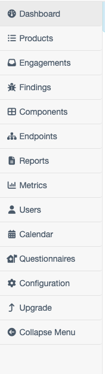
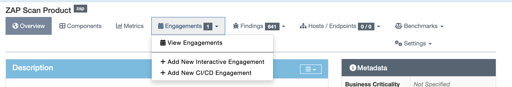

# Defect Dojo tutorial

## Requirements
 
1. Docker  and Docker Compose
2. Basic knowledge of scripting (Python and bash)
3. Computer LOL

## Setup DefectDojo

I have downloaded and installed defectdojo using following [github](https://github.com/DefectDojo/django-DefectDojo) link. Please refer this [README.md](https://github.com/DefectDojo/django-DefectDojo/blob/master/README.md) for more in depth tutorial.


I simply followed these steps copy and paste these in the terminal
```bash
# Clone the project
git clone https://github.com/DefectDojo/django-DefectDojo
cd django-DefectDojo

# Check if your installed toolkit is compatible
./docker/docker-compose-check.sh

# Building Docker images
docker compose build

# Run the application (for other profiles besides postgres-redis see  
# https://github.com/DefectDojo/django-DefectDojo/blob/dev/readme-docs/DOCKER.md)
docker compose up -d

# Obtain admin credentials. The initializer can take up to 3 minutes to run.
# Use docker compose logs -f initializer to track its progress.
docker compose logs initializer | grep "Admin password:"
```

When defectdojo is successfully installed we need to create an engagements for that so 
### How to create engagements?

open your defectdojo dashboard in the left pane you can see product in **second** option please refer the following image 



click on `Products`  Create a New Product my clicking on the gear icon  Fill in the required details and after that click submit. After that you created product click on the product you just created. 
### Creating Engagements
Under product menu items click on `Engagements` refrence the image below


After that click on the `Add new interactive engagments` or either of one it must begin with Add so that we creating new engagements.

After filling the required details click on done  click on the engagements that you just created if you look the url closely you can find the engagement id  the url is usually like this `http://localhost:8080/engagement/1` if the last digit is `1` then your engagement id is `1`. 

### Adding and Running the test report 


> [!NOTE]
> We will be utilizing the api endpoints given by defect dojo in our script which is `/api/v2/import-scan/` the api endpoints option are available at `http://localhost:8080/api/v2/oa3/swagger-ui/` replace `localhost` and `8080` according to your defectdojo url and port


I have created `upload_to_defectdojo.py` that will utilized above endpoints and uses arguments to pass the `API keys`, `defect dojo url`, `engagement id`, `report file`, `scan type` 

To run the import scan run the following script replace the argument varaiables according to your need

```bash
python upload_to_defectdojo.py --file snyk_report.sarif --engagement 3 --scan-type "SARIF" --host ${{ secrets.DEFECTOJO_URL }} --api-key ${{ secrets.DEFECTOJO_TOKEN }}
```

#### How to find scan type?
If you go  to `http://localhost:8080/api/v2/oa3/swagger-ui/` if you expand `Import scan` option and api endpoint option and scroll a little bit down you can find the scan types.


### Running the evaluations

> [!NOTE]
> I have create the threshold if it finds at least 1 critical, 2 high, 10 medium vulnerabilities then it will fail we can make that vulnerabilities as false positive and rerun the pipeline to make success

I have created `evalution.py` python script that will also utilize  `/api/v2/findings/` api endpoints now let's get it  going by supllying api key and host url as an arguments and also the product id
```bash
python evalution.py --url ${{ secrets.DEFECTOJO_URL }} --api-key ${{ secrets.DEFECTOJO_TOKEN }} --product 1
```

### How to turn any cves to false positive?

> [!TIP]
> Reference this [URL](https://docs.defectdojo.com/en/working_with_findings/intro_to_findings/) for more info about false positives

Go to defectdojo url dashboard click on view finding details then click on the three dot icon in any of the findings click on edit  scroll down find `false positive` and click on the check box and also you can uncheck the `Active` option then click  `Finished` there are other ways to convert into false positive also please explore that options.


